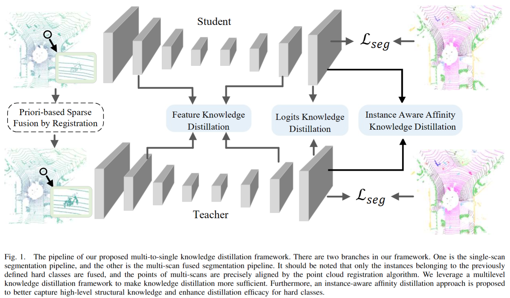
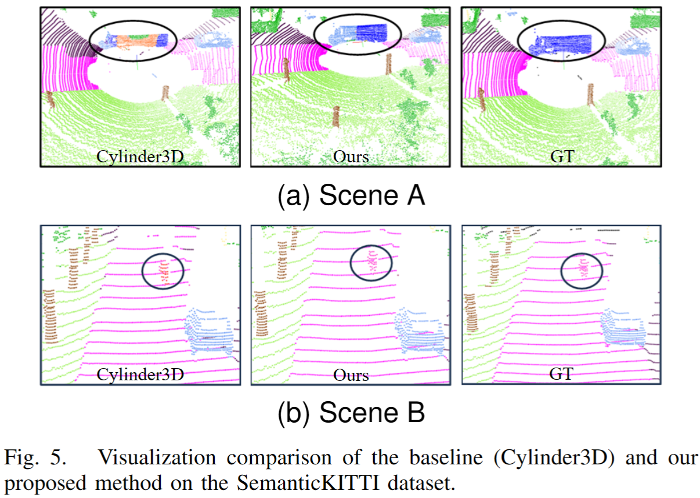

## Official code for our paper

Multi-to-Single-Knowledge-Distillation-for-Point-Cloud-Semantic-Segmentation

<pre>
Multi-to-Single Knowledge Distillation  for Point Cloud   Semantic Segmentation
Shoumeng Qiu, Feng Jiang, Haiqiang Zhang, Xiangyang Xue, Jian Pu
Corresponding-author: Jian Pu
</pre>

### Abstract

3D point cloud semantic segmentation is one of the fundamental tasks for environmental understanding. Although significant progress has been made in recent years, the performance of classes with few examples or few points is still far from satisfactory. In this paper, we propose a novel multi-to-single knowledge distillation framework for the 3D point cloud semantic segmentation task to boost the performance of those hard classes. Instead of fusing all the points of multi-scans directly, only the instances that belong to the previously defined hard classes are fused. To effectively and sufficiently distill valuable knowledge from multi-scans, we leverage a multilevel distillation framework, i.e., feature representation distillation, logit distillation, and affinity distillation. We further develop a novel instance-aware affinity distillation algorithm for capturing high-level structural knowledge to enhance the distillation efficacy for hard classes. Finally, we conduct experiments on the SemanticKITTI dataset, and the results on both the validation and test sets demonstrate that our method yields substantial improvements compared with the baseline method. 

        

 

### Visualization

        

### Code 

For the training details, please refer to the instructions provided in [PolarSeg](https://github.com/edwardzhou130/PolarSeg) and [Cylinder3D](https://github.com/xinge008/Cylinder3D) codebase.

We thanks for the opensource [PolarSeg](https://github.com/edwardzhou130/PolarSeg) and [Cylinder3D](https://github.com/xinge008/Cylinder3D) codebase。 
